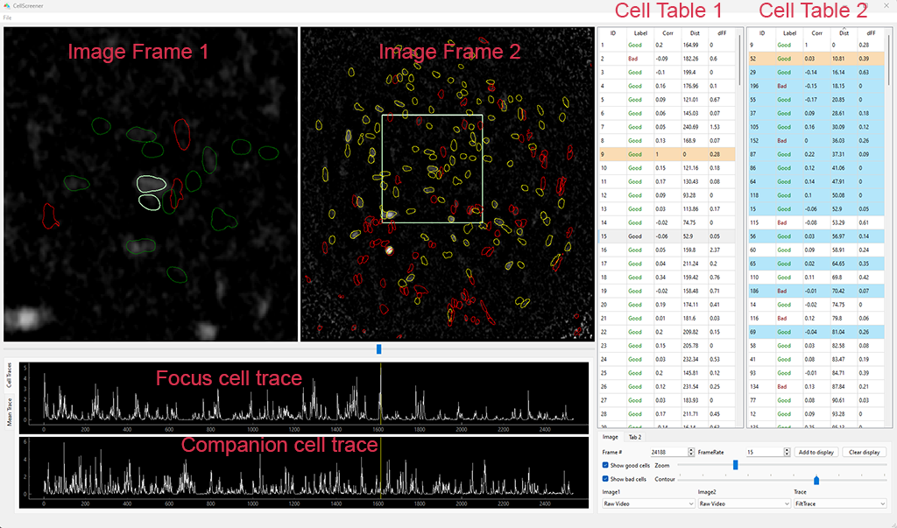

# CScreener

CScreener is a PySide6-based GUI for processing the CNMFE preprocessing output in calcium imaging videos. It is a remake of an old MATLAB cell picking GUI with several improvements:

- Faster video loading using OpenCV.
- Smoother experience with heavy computing tasks such as computing the maximum projection frame handled by a separate thread, making the app responsive to user actions even during computation.
- More functions with efficient use of space, more figures, and information organized in tables and tabs.
- Scalable with the possibility to add more functions and modules in the future.

However, the app has one drawback. Python lacks support for `v7.3` mat files, making the app support direct writing only on large mat files (>2GB) through h5py. While the writing ("Save to MS") is limited to the cell_label field, and the file is opened only in saving, it is recommended to back up beforehand.

To deal with the complexity of different versions of .mat file, CScreener provides multiple options for exporting ms files:  
`Export MS` is available when current MS file is `v7.0` or earlier.  
`Save to MS` is for `v7.3` mat files. modifying the cell label directly to the original MS file. The MS file must have a native field named 'cell_label' pointing to a number_of_cells x 1 vector, or the save will fail.  
`Save Lean MS` tries to save the MS file with only the necessary info: FiltTraces, RawTraces, Spikes, Contours, cell_label in `v7.0`. Saving fails if the file is too large (>2 GB)  
`Export Label as CSV` is the last resort if saving to MS fails. This option works for all scenarios.

## Installation

Clone the repository. Navigate to root folder in Anaconda Prompt. Create the conda environment from environment.yml.

```bash
conda env create --file environment.yml
```

Navigate to setup.py, install the package

```bash
python setup.py install
```

## Usage

Open the app from anaconda prompt

```python
screen-cell
```



Load video and mat file.
To focus on a particular cell, you can use either of the following methods:  
(1). Double click the row in the Cell Table 1
(2). Double click the contour in the Image Frame 2  
Once a cell activated, it will be highlighted in orange in the Cell Table 1.

To zoom in on the focused cell, use the zoom slider
To adjust the contour size, use the contour slider
You can sort the cells by clicking the column header in the Cell Table 2, or more conveniently, by using keyboard shortcuts:

- ID: `A`
- Correlation: `S`
- Distance: `D`
- dFF: `F`

To select a companion cell for comparison with the focused cell, double-click its entry in Cell Table 2.  
Use `I/K` to move up and down in Cell Table 1; `O/L` to move up and down in Cell Table 2. If none are activated, `K/L` activates first row, `I/O` activates the last row. You can jump to the maximum intensity frame of the focused cell by pressing `B`, and to the maximum intensity frame of the companion cell by pressing `N`. To toggle the label of the focused cell, press `G`, and to toggle the label of the companion cell, press `H`.

Cell Table 2 supports multi-selection. Selected cells are previewed in image frame 1, and their contours can be added to the display by clicking the `Add to display` button. The added cells will be highlighted in blue.

Cell Table 2 also colors the entries by the number of user visits. Entries that have been visited 1-2 times are colored light green/red, those visited 3-4 times are colored medium green/red, and those visited more than 5 times are colored dark green/red. To reset the number of visits, click the header of the `Label` column.

## Contribute

I am currently writing test cases, which will be added to the repository soon

If you would like to contribute, please feel free to fork this repository and test your edits. Once you have tested your changes, you can create a pull request and I will review it as soon as possible.

<!--
## Contributing

Pull requests are welcome. For major changes, please open an issue first
to discuss what you would like to change.

Please make sure to update tests as appropriate.-->

## License

[MIT](https://choosealicense.com/licenses/mit/)
