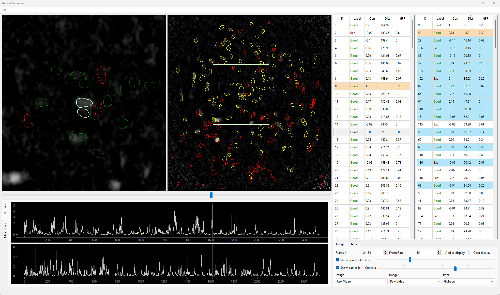

# CScreener

CScreener is a remake of my old MATLAB cell picking GUI designed to process the CNMFE(Constrained Nonnegative Matrix Factorization) preprocessing output for calcium imaging videos. There are several advantages this remake holds over the old MATLAB app (which is also why I remade it):

- Much more faster loading large videos thanks to opencv.
- Much smoother experience. Heavy computing tasks like computing the maximum projection frame is handled by a separate thread so the app is responsive to user action even during computing.
- More functions. The space was used more efficiently with more figures and information organized in tables and tabs.
- More possibilities. More functions will be easily added in the future per user request.

There is one drawback. Because of the lack of support for `v7.3` mat files in python, the app does not support large (>2GB) mat files. At this moment the problem can be circumvented by pruning out unnecessary data to shrink the size or by down-sampling the mat file. In the future I will add HDF5 reading to solve this problem ultimately.

## Installation

Clone the repository. Navigate to root folder in Anaconda Prompt. Create the conda environment from environment.yml.

```bash
conda env create --file environment.yml
```

Navigate to find setup.py, install the package

```bash
python setup.py install
```

## Usage

Open the app from anaconda prompt

```python
screen-cell
```



In file menu, load video and mat file.
Focus on cell by one of the following methods:  
(1). double clicking the row in the cell table 1 (the one on the left)
(2). double clicking the contour in the overview image  
Once activated, the cell will be highlighted in orange in cell table 1. `I/K to move up/down cell table 1`

Zoom into the focused cell using zoom slider
Adjust the contour size using contour slider
Sort the cells by clicking the column header in cell table 2. Keyboard shortcut for sorting by each column are:  
`ID = A; Correlation = S; Distance = D; dFF = F`  
Select the companion cell you want to compare with the focus cell by double clicking its entry in the cell table 2. `Press O/L to move up/down the cell table 2`. When none are activated, I/O activates first in the table and K/L activates last in the table.  
`Jump to maximum intensity frame of focus cell = B, of companion cell = N`  
`G = Toggle label of focus cell`, `H = Toggle label of companion cell`

The cell table 2 support multi selection. Selected cells are previewed in image 1. The contours can be added to display by clicking the `Add to display` button. The added cells will be highlighted in blue.

Modified mat file can be saved through File menu.

<!--
## Contributing

Pull requests are welcome. For major changes, please open an issue first
to discuss what you would like to change.

Please make sure to update tests as appropriate.-->

## License

[MIT](https://choosealicense.com/licenses/mit/)
